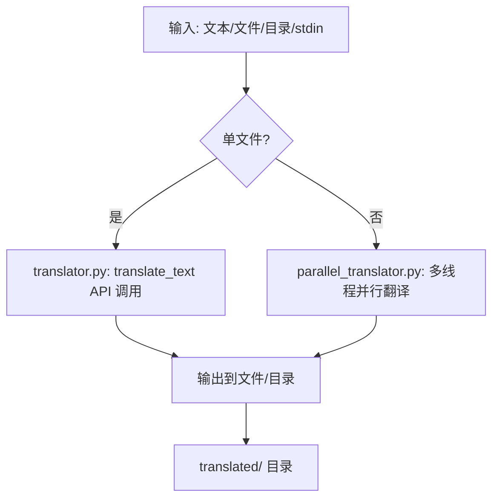

# Python 翻译 CLI 程序

一个使用 OpenRouter API 的命令行翻译工具，支持单/多文件并行翻译英文文本到指定语言（如中文）。基于 GPT-3.5-turbo 模型，包含重试机制和多线程支持。

## 功能说明
- **单文本/文件翻译**：直接翻译短文本或单个文件，整个内容作为一个 API 调用。
- **多文件并行翻译**：同时翻译多个文件或目录下所有 .txt 文件，使用多线程加速（默认 5 线程）。
- **输入支持**：命令行文本、stdin、文件列表、目录。
- **输出管理**：自动保存到指定目录，添加 `_translated` 后缀。
- **错误处理**：API 速率限制自动重试（最多 5 次，指数退避）；无效密钥或网络错误抛出异常。
- **限制**：输入假设为英文；长文本不拆分（可能超 API 令牌限）；仅 .txt 文件。

### 架构流程


## 安装指南
1. **前提**：Python 3.7+ 已安装。获取 OpenRouter API 密钥（注册 [openrouter.ai](https://openrouter.ai) 并生成密钥）。
2. 克隆项目：`git clone <repo-url>` 或下载 ZIP。
3. 安装依赖：`pip install -r requirements.txt`（安装 requests 和 python-dotenv）。
4. 配置环境：
   - 复制 `.env.example` 为 `.env`。
   - 编辑 `.env`：`OPENROUTER_API_KEY=your_api_key` 和 `NUM_THREADS=5`（可选，调整线程数）。
5. 测试安装：`python main.py --help`（显示参数帮助）。

**注意**：确保 `.env` 不提交到 Git（添加至 .gitignore）。如果 pip 失败，尝试 `pip3` 或虚拟环境 `python -m venv env && source env/bin/activate && pip install -r requirements.txt`。

## 使用方法
运行 `python main.py [参数]`。默认目标语言 'zh'（中文）。

### 参数说明
- `--input, -i <file1 file2 ...>`：多个输入文件路径。
- `--input-file <file>`：单个输入文件（默认 'test_input.txt'）。
- `--input-dir <dir>`：输入目录（翻译所有 .txt 文件）。
- `--output, -o <file>`：单文件输出路径（仅单输入有效）。
- `--output-dir <dir>`：输出目录（默认 'translated/'，多文件使用）。
- `--target-lang, -t <lang>`：目标语言代码（默认 'zh'，如 'fr' 为 French）。
- `--file-types FILE_TYPES`：指定要翻译的文件扩展名（逗号分隔，默认从.env的FILE_TYPES读取；无指定时处理所有文件）。
- `text`（位置参数）：直接翻译的文本（如果无文件输入）。

**输入优先级**：`--input-file` > `--input` > `--input-dir` > 文本/stdin。

### 运行示例
1. **基本文本翻译**（输出到默认文件）：
   ```bash
   python main.py "Hello, world!" --target-lang zh
   ```
   输出：`translated/translated__Hello, world!.txt`（临时文件处理）。

2. **单文件翻译**：
   ```bash
   python main.py --input-file test_input.txt --output output.txt --target-lang zh
   ```
   输出：`output.txt` 包含翻译结果。

3. **多文件并行翻译**：
   ```bash
   python main.py --input file1.txt file2.txt --output-dir multi_output/ --target-lang fr
   ```
   输出：`multi_output/file1_translated.txt` 和 `multi_output/file2_translated.txt`。

5. **指定文件类型翻译**：
   ```bash
   python main.py --input-dir ./test_multi_types --output-dir ./output --file-types=py
   ```
   示例：只翻译.py文件。

4. **目录翻译**：
   ```bash
   python main.py --input-dir input_folder/ --target-lang zh
   ```
   输出：`translated/` 下所有 .txt 的翻译版本。

5. **从 stdin 读取**：
   ```bash
   echo "This is a test." | python main.py --target-lang es
   ```
   输出：`translated/translated__This is a test..txt`。

**提示**：使用 `--help` 查看完整帮助。翻译进度会在控制台打印（API 尝试次数）。

## 环境变量
- `OPENROUTER_API_KEY`：必需，OpenRouter API 密钥。
- `NUM_THREADS`：可选，并行线程数（默认 5，过多可能触发速率限制）。

## 配置
创建 `.env` 文件以设置默认配置：
- `FILE_TYPES=txt,md`：默认只翻译 .txt 和 .md 文件（逗号分隔列表）。
- 如果 API 密钥无效，将使用 mock 翻译模式。

示例 `.env`：
```
OPENROUTER_API_KEY=your_api_key
NUM_THREADS=5
FILE_TYPES=txt,md
```

**注意**：命令行参数优先于 .env 配置。

## 故障排除
- **API 密钥无效 (401 错误)**：检查 `.env` 中的 `OPENROUTER_API_KEY` 是否正确。重新从 OpenRouter  dashboard 获取。
- **速率限制 (429 错误)**：程序自动重试（等待 2-32 秒）。如果频繁，减少 `NUM_THREADS` 或等待 API 额度恢复。检查 OpenRouter 使用量。
- **翻译失败 (TranslationFailedError)**：网络问题或 API 响应无效。检查互联网连接，重试命令。长文本可能超令牌限——拆分文件手动运行。
- **文件不存在**：确保输入文件/目录路径正确。目录模式仅处理 .txt 文件。
- **IO 错误 (无法写入输出)**：检查输出目录权限，创建 `mkdir -p translated/`。
- **空输入**：程序会警告并退出，无害。
- **依赖安装失败**：确保 pip 最新 `pip install --upgrade pip`，或使用 conda/mamba。
- **调试**：添加 `print` 语句或运行单文件模式测试 API。查看控制台日志（如 "API call attempt 1/5"）。

## 注意事项
- 命令行参数 `--file-types` 优先于 .env 中的 `FILE_TYPES`。
- 如果 `--file-types` 无效或为空，将打印错误并退出程序。
- 如果输入目录中无匹配文件类型，将打印警告但继续执行（如果有其他输入）。

## 贡献与许可证
欢迎 PR！项目使用 MIT 许可证（添加 LICENSE 文件）。报告 issue 时提供命令、错误日志和输入示例。

**版本**：v1.0（基于当前代码）。